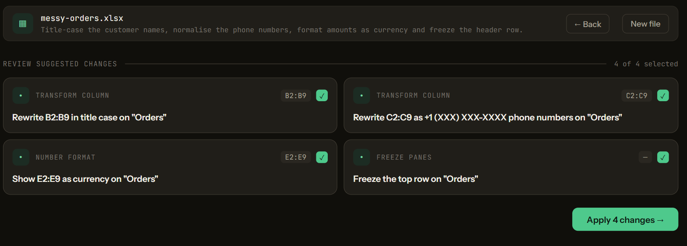
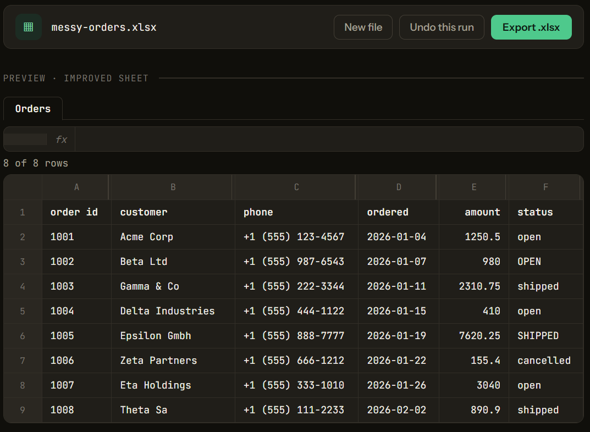
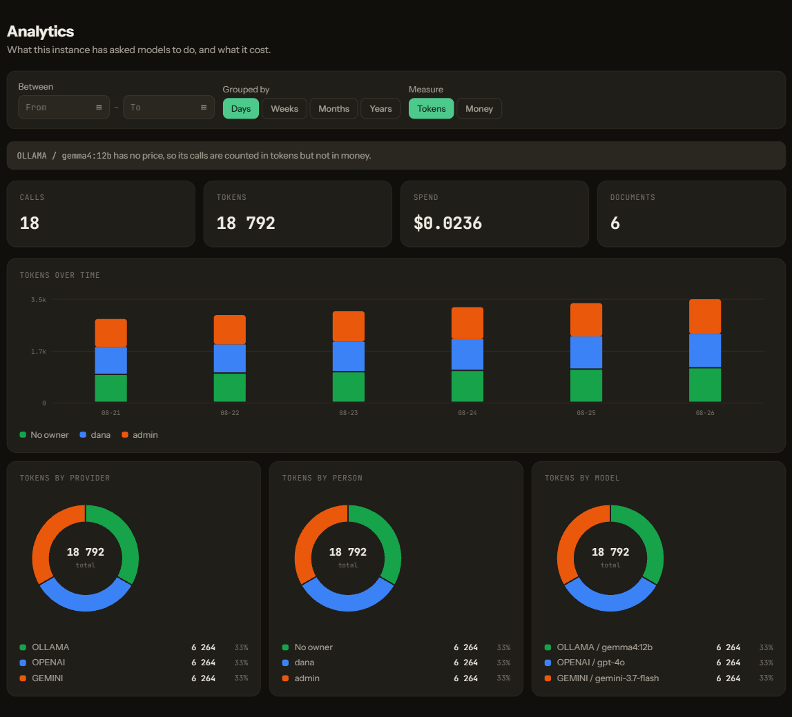
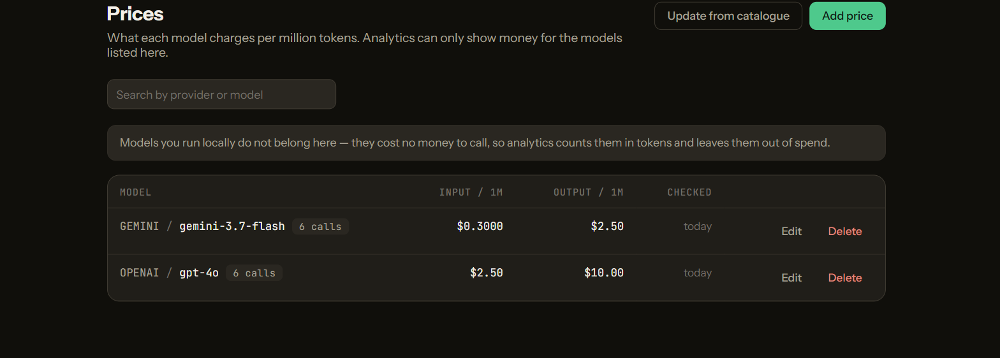
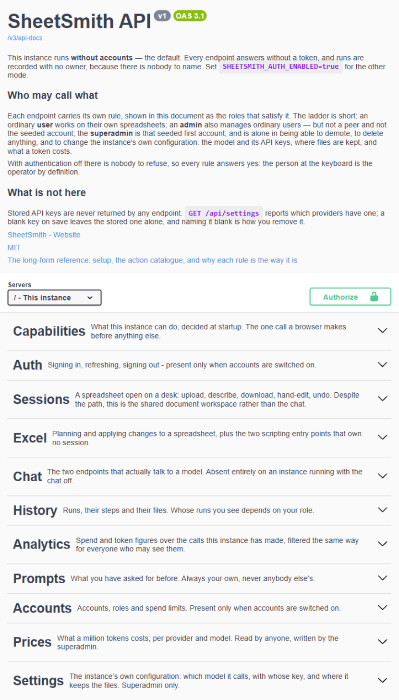

# SheetSmith

Upload a spreadsheet, say what you want in plain language, review the plan, apply it.
Self-hosted, and built so the language model never receives your table.

```bash
cd sheetsmith-java
cp .env.example .env
docker compose up --build     # Postgres, Ollama, the model and the app
# open http://localhost:8080
```

Runs against a local Ollama by default; OpenAI and Anthropic are one profile switch away.



Every step is a sentence you can read, edit or drop. Nothing touches the file until you say so:



**Try it on the sheet in this repository.** [`docs/messy-orders.xlsx`](docs/messy-orders.xlsx) is a
deliberately untidy order list — everything stored as text, names in four different cases, phone
numbers in five different formats. Upload it and ask for exactly what the screenshots above asked
for:

> Tidy this up: make the header row stand out and freeze it, show the amounts as currency, tidy the
> customer names and phone numbers, and widen the columns to fit.

That plan was produced by a 12B model running locally, on the machine that took the screenshots.

---

## What it does

Two ways to work on the same file, sharing one engine and one undo history:

- **Improve** — one instruction, a plan you can read and edit before anything runs, then apply.
  Every step is a sentence: *"Show C2:C500 as currency"*, *"Draw a thin border around the outside
  on A1:D20"*. This is the main flow.
- **Chat** — a side panel that answers questions about the sheet and edits it turn by turn.

Uploading opens a session whose working copy is an append-only chain of revisions, so an improve
run and a chat turn can never leave each other behind, and undo covers both.

Both boxes remember how you ask. A phrasing you have used more than once comes back as a
suggestion — used once is not yet a habit — with the most used first and the most recent breaking a
tie. They are kept per person and per flow, so improve and chat never offer each other's wording,
and nobody is ever offered somebody else's.

Two more screens, once an instance has been used for a while:

- **History** — every run, with filters, and what each one actually did step by step.
- **Analytics** — what has been asked of the models and what it cost: tokens and money by provider,
  by model and by person, spend over time, and whether the runs themselves succeeded.



## What a run costs

Every call to a model is recorded — who asked, which provider and model answered, how many tokens
each way, how long it took. That record is the whole of the analytics screen, and it is kept honest
in one particular way: **a number that is not known is never shown as a number**.

A local model bills nothing, so its calls are counted in tokens and left out of money. A model
nobody has priced costs an unknown amount, so it is named rather than quietly counted as free — a
total that silently leaves out half the calls is worse than an absent one, because it looks like an
answer.

Prices are yours to enter, because nobody but you knows what you pay. **Prices** lists them, says
how long since each was last checked, and can compare them against a published catalogue — it shows
what would change and writes nothing until you say so.



## The model does not read your table

The engine is built the other way round from most spreadsheet assistants. The model is handed the
**structure** — sheet names, column headers, ranges, the formulas already present — and then has to
*ask* for computations: sum this column, find these rows, evaluate this formula. Java runs them
with Apache POI and hands back only the small result.

So an answer like *"Widget A sold most, 1 240 units"* is produced from a `MAX` the engine ran, not
from a model that read 50 000 rows. It also means every answer is auditable: each chat reply carries
the chain of steps that produced it, written in plain language rather than as tool calls.

Two things to be precise about, because a privacy claim is worth only its exceptions:

- **Chat tools return real cell values** — the ones its own queries produce. The model never
  receives the whole table, only the result of each step it runs.
- **Improve sends structure**, plus the text label beside an existing formula, which it uses to
  avoid duplicating totals it already added.

Both go away with one setting. `SHEETSMITH_CHAT_ENABLED=false` makes an improve-only instance where the
only thing that can reach the model is the sheet's structure — names, headers, ranges, formula text —
and the parts that could send anything else are absent from the running application rather than
merely unused. The [backend README](sheetsmith-java/README.md#running-without-the-chat) lists
exactly what is removed.

## What is in here

| Directory | What |
|---|---|
| `sheetsmith-java/` | Spring Boot 4 / Java 25 backend and the action engine. Start here — its [README](sheetsmith-java/README.md) covers configuration, the API and every action. |
| `sheetsmith-react/` | The Vite + React UI. Built into the backend jar; served on the same origin as the API. |

The engine has **41 actions** — formatting, number formats, borders, alignment, charts, formulas,
sorting, filtering, inserting and deleting rows and columns, deduplication, validation, tables,
bulk column rewrites. Both halves are tested: the backend with JUnit, the UI with Vitest. New actions are `@Component` beans discovered at startup;
`sheetsmith-java/ARCHITECTURE.md` explains how the pieces fit together.

## Running without Docker

Java 25, Maven 3.9+, PostgreSQL 14+, and an Ollama you already run:

```bash
cd sheetsmith-java && mvn spring-boot:run      # API on :8080
cd sheetsmith-react && npm install && npm run dev   # UI on :5173, proxied to :8080
```

Note that `mvn package` alone builds a jar **without** the UI in it — the frontend is a separate
project. Run `npm run build` in `sheetsmith-react/` first if you want a self-contained jar; the
release workflow and the Docker image both do this for you.

## Accounts

Off by default. Solo on your own machine a login screen is a cost with no matching risk, so nothing
changes unless you ask for it:

```bash
SHEETSMITH_AUTH_ENABLED=true
```

The first account comes from a migration: **`admin` / `admin`**. That is written here rather than
generated because a password you can look up beats one nobody can find — and the app nags in the
interface until it is changed. Change it first.

Three roles. A **user** just uses the app. An **admin** creates accounts, renames them, resets
passwords, sets spend limits, and can make somebody else an admin — but cannot take it back, and
cannot do any of it to a fellow admin or to the seeded account. Only the **superadmin**, which is
the seeded first account, can demote or delete, and only it reaches the machine's own configuration:
the model settings and their API keys, where the files live, and what a token costs. That one-way
door is deliberate: two administrators demoting each other is a fight the software should not host,
so undoing it is left to the one account an instance always keeps — and an admin who could reset
that account's password would be walking straight through it.

Upgrading an instance that already had accounts does not take anything away — everybody who could
manage accounts yesterday becomes an admin, and only new accounts start as plain users.

The default account cannot be deleted, you cannot delete the account you are signed in with, and
nobody can change their own role. An instance cannot be locked out of itself, and a limit is not
something the limited person can lift — with one exception, below, that the shape of the hierarchy
forces.

### Whose work you can see

The history and the analytics answer the same question about somebody's work, so they answer it the
same way. A **user** sees their own runs and nobody else's. An **admin** sees their own and every
plain user's, but not a fellow admin's — the same wall that stops them managing each other. The
**superadmin** sees everything. Runs from before an instance had accounts belong to nobody, so they
go to the administrators rather than to whoever signs in next.

The rule holds all the way down rather than only in the list. The page count counts what you may
see rather than what was hidden from you. A filter naming somebody else returns your own work, not
theirs. The per-person breakdown in analytics names only the people you may see, and its totals
count the same runs the history shows. The spreadsheet behind a run is guarded as well as the row
describing it. And a run you are not allowed to see is reported **not found** rather than
forbidden, because "forbidden" would confirm that it exists.

Deleting is narrower than seeing: only the superadmin removes a run, whoever it belongs to. Being
able to see somebody's work is not the same as being allowed to erase it.

### What a person may spend

Everybody starts with no limit. An admin can set a monthly ceiling on the users they look after;
only the superadmin sets an admin's — and sets their own, because there is nobody above them to do
it. That is the one exception to nobody setting their own limit, and it exists because the
alternative is a ceiling no account on the instance can ever adjust.

A month is a calendar month, so last month's spending is last month's. Under the ceiling a run
proceeds; at it a run is refused, and the refusal says how much of what has gone — a number you can
act on rather than a closed door.

Only what has a price counts. A model you run locally is free, so it never counts towards a limit —
even if somebody has priced that model, a local call to it is still free while a cloud call to the
same name still counts. A model nobody has priced counts as nothing, because unknown is not the
same as expensive.

Your own figure is readable without going near the accounts screen; the bar sits where you work.
Everybody sees their own whatever their role, an admin sees the users they look after but not a
peer's, and a plain user sees nobody else's.

**Running low.** Inside the last fifteen per cent of a limit, a button appears to ask for a bigger
one. With room to spare there is nothing to ask about, and with no limit there is no ceiling to
raise. One request stands at a time. An admin approves it — an approval that would not actually
raise anything is refused rather than sent back as a lie — or declines it, which leaves the limit
exactly where it was. Nobody answers their own request, no request is answered twice, and either
outcome reaches the person who asked, once. An approved request remembers the figure it was
approved at, not whatever the limit happens to be later.

**Forgot the password?** There is no email recovery — a self-hosted instance has no mail server, and
nobody else can reach your database. Two ways back in:

```bash
# Set it, start once, then remove the variable.
SHEETSMITH_ADMIN_PASSWORD_RESET=whatever-you-want
```

or, if you can reach the database but not the environment, put the default password back by hand —
this is the bcrypt hash of the word `admin`:

```sql
update users
set password_hash = '$2a$10$VXN.dor9JKKtAZ7xjhernu5kcCmarsDg1L7s.yN5z37tUP/rmWMGu',
    must_change_password = true
where id = (select min(id) from users);
delete from refresh_tokens;
```

This is not a hole. Anyone who can run that already has your database, and with it every session
and every stored API key.

## Files it keeps

Every run's input and its result stay on disk, because the history offers a Download button and a
button that cannot deliver is a lie. They go on their own after `SHEETSMITH_TTL_DAYS` (seven by
default), and the superadmin can say more than that under **Settings → Storage**:

- **where they live** — a folder of your choosing rather than the one the process started in. New
  files go there; the ones already written stay where they are and remain downloadable, because a
  half-finished move leaves a history pointing at files that are somewhere else;
- **how many to keep**, and **how much disk to use**. Either or both; whichever is reached first
  wins. Over the line, the oldest finished run goes first — a run still working is never taken, and
  neither is a file an open chat session is editing.

Both caps are optional and empty means no cap. A zero is refused rather than obeyed: it would mean
"delete every run as it finishes", which is not something anybody says by leaving a box empty.

## The API

Everything the interface does is an HTTP call you can make yourself. The reference is generated from
the code that serves it and lives at **`/swagger-ui.html`** on a running instance (`/v3/api-docs`
for the raw document): every endpoint says what it does and which role it needs, and *Authorize*
takes the token from `POST /api/auth/login` so you can try them from the page.



The preamble is not a fixed blurb. The instance writes it from its own configuration, which is why
the screenshot says *without accounts* — that is how the instance serving it was running. One that
requires a login says so instead, and says what that means for every rule below.

Underneath, everything under `/api` is denied unless something opens it, and what opens it is a
`@PreAuthorize` on the handler — beside the mapping, in the file you would open to see what the
endpoint does, rather than in a list of paths maintained somewhere else. The weakness of that
arrangement is that an annotation is something a person has to remember, and this application
already lived through it: five endpoints had been added without one, open to every account on the
instance, with nothing saying so. So it is enforced rather than intended. One test walks the
handlers Spring actually registered — not the source, not a maintained list — and fails if any of
them carries no rule; the only exceptions are the three ways in and the capability probe, each of
which has to answer before anybody is signed in. A second test signs in as each of the three roles
and checks the guarded endpoints over HTTP, so the rules are tested by their effect and not by
their spelling.

## Status

Working and in use, being prepared for a wider audience. Known gaps, so nobody has to discover them
the hard way:

- authentication is **off by default** — run that way, the app is designed for a machine you
  control, and the CORS allowlist is the only thing between a browser and the API. Set
  `SHEETSMITH_AUTH_ENABLED=true` for a login screen and accounts ([above](#accounts));
- **spend limits only see what has a price**: a local model costs nothing and an unpriced one costs
  an unknown amount, so neither counts towards a limit. That is the honest reach of a ceiling
  denominated in money — the alternative would be to guess, and a budget enforced against a guess is
  worse than none. The interface says so where the limit is set, and
  [What a person may spend](#what-a-person-may-spend) has the rest of the rules;
- the database is still called `xlsxai` by default, from before the app was called SheetSmith —
  deliberately, because changing that default would point an existing install at an empty database.
  Everything else has been renamed: settings are `sheetsmith.*` and environment variables
  `SHEETSMITH_*`, with the old `XLSXAI_*` names still read as a fallback so an existing `.env`
  keeps working.

Issues and pull requests are welcome — [CONTRIBUTING.md](CONTRIBUTING.md) covers what gets merged, running both
halves, the bar for new code, and how to add an action. Security posture and how to report
something: [SECURITY.md](SECURITY.md).

## Licence

**Source-available, not open source** — see [LICENSE](LICENSE). The difference is worth two
sentences, because the word gets used loosely and you should know what you are getting.

**Free, no permission needed, no fee:** run it unmodified on your own machine or your company's own
servers, for one person or for all your staff. Your work may be commercial — a business may run it
on its own books, and you may use it as a tool in work you are paid for. Read the source. Pass on
verbatim copies.

**By agreement with the author:** offering it to other people over a network, and changing the code
— adding features, altering behaviour, or shipping a modified version. Hosting needs an agreement
whether or not you charge for it, and so does earning from it any other way: subscriptions,
advertising, sponsorship, bundling it into something you sell. The line is *use it to do your work,
do not make it the product you sell.* These rights are reserved and do not expire. If you need
either, [open an issue](https://github.com/MishaStoyanov/sheetsmith/issues) and ask; paid
customisation is how the project is funded.

Contributions are welcome and are the one exception: you may modify your copy to prepare a pull
request. [CONTRIBUTING.md](CONTRIBUTING.md) says what gets merged.
