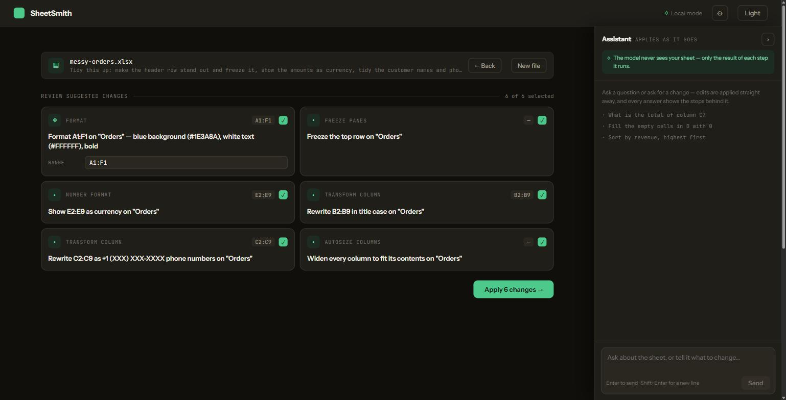
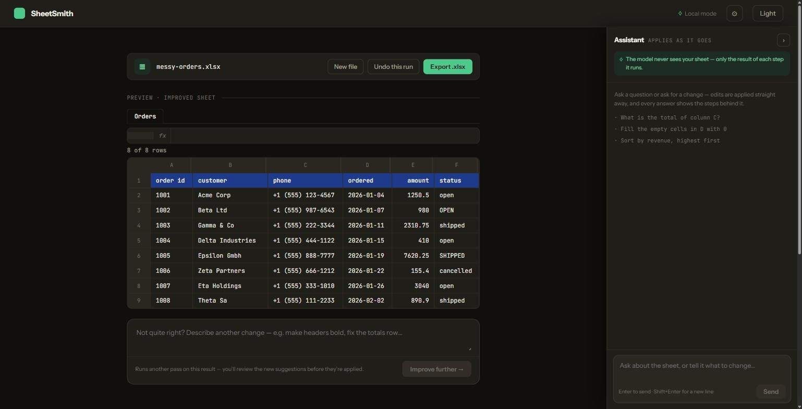

# SheetSmith

Upload a spreadsheet, say what you want in plain language, review the plan, apply it.
Self-hosted, and built so the language model never receives your table.

```bash
cd sheetsmith-java
cp .env.example .env
docker compose up --build     # Postgres, Ollama, the model and the app
# open http://localhost:8080
```

Runs against a local Ollama by default; OpenAI and Anthropic are one profile switch away.



Every step is a sentence you can read, edit or drop. Nothing touches the file until you say so:



**Try it on the sheet in this repository.** [`docs/messy-orders.xlsx`](docs/messy-orders.xlsx) is a
deliberately untidy order list — everything stored as text, names in four different cases, phone
numbers in five different formats. Upload it and ask for exactly what the screenshots above asked
for:

> Tidy this up: make the header row stand out and freeze it, show the amounts as currency, tidy the
> customer names and phone numbers, and widen the columns to fit.

That plan was produced by a 12B model running locally, on the machine that took the screenshots.

---

## What it does

Two ways to work on the same file, sharing one engine and one undo history:

- **Improve** — one instruction, a plan you can read and edit before anything runs, then apply.
  Every step is a sentence: *"Show C2:C500 as currency"*, *"Draw a thin border around the outside
  on A1:D20"*. This is the main flow.
- **Chat** — a side panel that answers questions about the sheet and edits it turn by turn.

Uploading opens a session whose working copy is an append-only chain of revisions, so an improve
run and a chat turn can never leave each other behind, and undo covers both.

## The model does not read your table

The engine is built the other way round from most spreadsheet assistants. The model is handed the
**structure** — sheet names, column headers, ranges, the formulas already present — and then has to
*ask* for computations: sum this column, find these rows, evaluate this formula. Java runs them
with Apache POI and hands back only the small result.

So an answer like *"Widget A sold most, 1 240 units"* is produced from a `MAX` the engine ran, not
from a model that read 50 000 rows. It also means every answer is auditable: each chat reply carries
the chain of steps that produced it, written in plain language rather than as tool calls.

Two things to be precise about, because a privacy claim is worth only its exceptions:

- **Chat tools return real cell values** — the ones its own queries produce. The model never
  receives the whole table, only the result of each step it runs.
- **Improve sends structure**, plus the text label beside an existing formula, which it uses to
  avoid duplicating totals it already added.

Both go away with one setting. `SHEETSMITH_CHAT_ENABLED=false` makes an improve-only instance where the
only thing that can reach the model is the sheet's structure — names, headers, ranges, formula text —
and the parts that could send anything else are absent from the running application rather than
merely unused. The [backend README](sheetsmith-java/README.md#running-without-the-chat) lists
exactly what is removed.

## What is in here

| Directory | What |
|---|---|
| `sheetsmith-java/` | Spring Boot 3 / Java 21 backend and the action engine. Start here — its [README](sheetsmith-java/README.md) covers configuration, the API and every action. |
| `sheetsmith-react/` | The Vite + React UI. Built into the backend jar; served on the same origin as the API. |

The engine has **41 actions** — formatting, number formats, borders, alignment, charts, formulas,
sorting, filtering, inserting and deleting rows and columns, deduplication, validation, tables,
bulk column rewrites. Both halves are tested: the backend with JUnit, the UI with Vitest. New actions are `@Component` beans discovered at startup;
`sheetsmith-java/ARCHITECTURE.md` explains how the pieces fit together.

## Running without Docker

Java 21, Maven 3.9+, PostgreSQL 14+, and an Ollama you already run:

```bash
cd sheetsmith-java && mvn spring-boot:run      # API on :8080
cd sheetsmith-react && npm install && npm run dev   # UI on :5173, proxied to :8080
```

Note that `mvn package` alone builds a jar **without** the UI in it — the frontend is a separate
project. Run `npm run build` in `sheetsmith-react/` first if you want a self-contained jar; the
release workflow and the Docker image both do this for you.

## Accounts

Off by default. Solo on your own machine a login screen is a cost with no matching risk, so nothing
changes unless you ask for it:

```bash
SHEETSMITH_AUTH_ENABLED=true
```

The first account comes from a migration: **`admin` / `admin`**. That is written here rather than
generated because a password you can look up beats one nobody can find — and the app nags in the
interface until it is changed. Change it first.

Everyone signed in can manage everyone else: create accounts, rename them, reset passwords. There
are no roles yet. The default account cannot be deleted and you cannot delete the account you are
signed in with, so an instance cannot be locked out of itself.

**Forgot the password?** There is no email recovery — a self-hosted instance has no mail server, and
nobody else can reach your database. Two ways back in:

```bash
# Set it, start once, then remove the variable.
SHEETSMITH_ADMIN_PASSWORD_RESET=whatever-you-want
```

or, if you can reach the database but not the environment, put the default password back by hand —
this is the bcrypt hash of the word `admin`:

```sql
update users
set password_hash = '$2a$10$VXN.dor9JKKtAZ7xjhernu5kcCmarsDg1L7s.yN5z37tUP/rmWMGu',
    must_change_password = true
where id = (select min(id) from users);
delete from refresh_tokens;
```

This is not a hole. Anyone who can run that already has your database, and with it every session
and every stored API key.

## Status

Working and in use, being prepared for a wider audience. Known gaps, so nobody has to discover them
the hard way:

- authentication is **off by default** — run that way, the app is designed for a machine you
  control, and the CORS allowlist is the only thing between a browser and the API. Set
  `SHEETSMITH_AUTH_ENABLED=true` for a login screen and accounts (see below);
- with accounts on, **there are no roles yet**: every account can manage every other one. That suits
  a small team and does not suit handing an account to someone you would not make an administrator;
- the database is still called `xlsxai` by default, from before the app was called SheetSmith —
  deliberately, because changing that default would point an existing install at an empty database.
  Everything else has been renamed: settings are `sheetsmith.*` and environment variables
  `SHEETSMITH_*`, with the old `XLSXAI_*` names still read as a fallback so an existing `.env`
  keeps working.

Issues and pull requests are welcome — [CONTRIBUTING.md](CONTRIBUTING.md) covers running both
halves, the bar for new code, and how to add an action. Security posture and how to report
something: [SECURITY.md](SECURITY.md).

## Licence

MIT — see [LICENSE](LICENSE).
